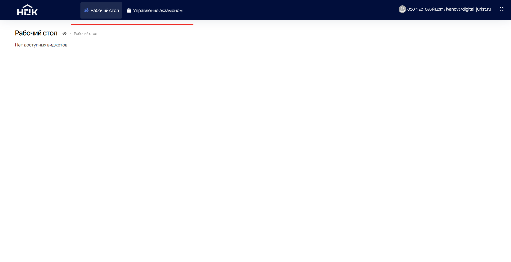
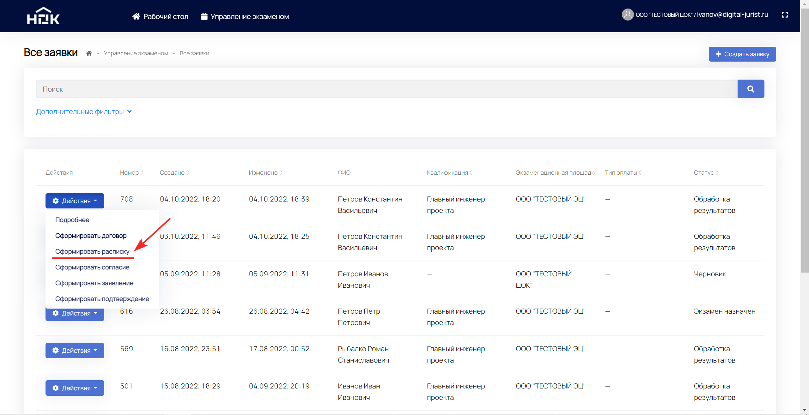
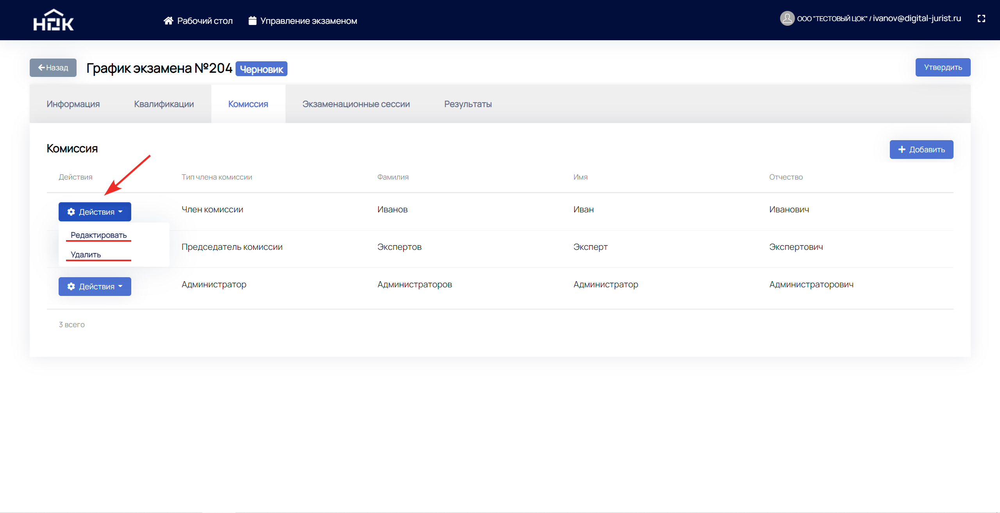

# Руководство администратора ЦОК

**Список обозначений и сокращений**
* **ПАК** - Программно-аппаратный комплекс
* **НОК** - Независимая оценка квалификации
* **ЭП** - экзаменационная площадка
* **ЭЦ** - экзаменационный центр

## Аннотация

Настоящий документ представляет собой руководство администратора ЦОК с ПАК НОК (далее **Руководство**).

Пользовательский интерфейс ПАК НОК обеспечивает проведение независимой оценки квалификации в форме профессионального экзамена.

Перед работой пользователя с ПАК НОК рекомендуется внимательно ознакомиться с настоящим руководством.

## Вход

Чтобы приступить к работе с ПАК НОК, необходимо выполнить вход. Для этого введите Ваши данные в поля **"Телефон / Email / СНИЛС"** и **"Пароль"**.  Затем нажмите на кнопку **"Войти"**. Пароль уже должен находиться у Вас на электронной почте. Если Вы не получили данные для входа, обратитесь в СПК.

Когда отобразится новое окно с надписью **"Продолжить как"**, нажмите на кнопку **"ЦОК"**.

## Начало работы

Перед Вами рабочий стол администратора ЦОК. На самом верху расположены два основных раздела: **"Рабочий стол"** (где сейчас Вы находитесь) и **"Управление экзаменом"**. Данные разделы будут подробнее рассмотрены ниже.

В правом верхнем углу слева направо находятся: **"Профиль"** и **"Полноэкранный режим"**.

## Настройки профиля

Нажмите на иконку с человеком или адрес электронной почты в правом верхнем углу.
Возникнет выпадающий список с возможными действиями.

Для работы с данными Вашего профиля, нажмите на пункт **"Профиль"**. Чтобы зайти под учетной записью соискателя, нажмите **"Перезайти"**. Нажмите **"Выйти"**, если Вы хотите завершить сеанс в ПАК НОК.

Откроются настройки с **Личной информацией** и **Изменением пароля**.
В разделе **"Личная информация"** можно редактировать данные. При изменении адреса электронной почты и/или телефонного номера, придётся их заново подтверждать. Обязательно сохраните последние изменения.

Задавайте новый пароль в любой момент с помощью раздела **"Изменить пароль"**. После подтверждения нового пароля обязательно нажмите **"Сохранить"**.

## Управление экзаменом

Теперь перейдем в раздел **"Управление экзаменом"**. Этот раздел предназначен для управления практическим экзаменом соискателей.

Работа с заявками и создание новых происходит в подразделе **“Все заявки”**. 

Подраздел содержит таблицу с необходимой информацией и возможными действиями по каждой заявке.

Для быстрого поиска нужной заявки можно воспользоваться расширенной фильтрацией, нажав на **“Дополнительные фильтры”**. В развернувшихся полях выберите критерии, по которым будет осуществлен поиск.

Для непосредственной работы с заявкой нажмите кнопку **“Действия”** на строке заявки.

Для просмотра полной информации по нужной заявке нажмите **“Подробнее”**.

Страница обновится и отобразится собранная информация по разделам заявки. Просмотреть сведения по каждому разделу можно нажав на название этого раздела. 

Под номером заявки отображается заголовок **“Управление”** и действия по заявке, если они доступны.

Для формирование договора между соискателем (как физлицом) и ЦОК нажмите на **“Действия”** и **“Сформировать договор”**.

В появившемся окне необходимо ввести стоимость проведения НОК и нажать кнопку **“Отправить”**. После этого произойдет скачивание уже заполненного договора. 

Чтобы скачать заполненную расписку в получении комплекта документов при приеме заявления соискателя, нажмите на **“Действия”** и **“Сформировать расписку”**.

Аналогичные действия необходимо произвести для скачивания следующих документов: *“Согласие на обработку персональных данных”*, *“Заявление для проведения независимой оценки квалификации”* и *“Письмо-подтверждение о дате, месте и времени проведения профессионального экзамена”*

### Создание заявки

Администратор ЦОК может самостоятельно добавлять заявки соискателей. Для этого нажмите на кнопку **“Создать заявку”** в правом верхнем углу.

На странице возникнет форма заявки с полями для заполнения. Введите номер СНИЛС и произойдет автозаполнение части данных соискателя.

Недостающую информацию необходимо ввести вручную. Если почта и/или телефон не будут заполнены, то логином пользователя будет СНИЛС.

Обязательно нажмите **“Продолжить”** для сохранения введенных данных.

Двигаясь поэтапно заполните всю остальную информацию о соискателе. В итоге готовая заявка отобразится в подразделе **“Все заявки”** на первой строке.

### Результаты экзаменов

Теперь перейдем в подраздел **“Все результаты”** посредством нажатия на его название в разделе **“Управление экзаменом”**.

Здесь доступен быстрый просмотр каждого экзамена. Также есть возможность расширенного поиска.

Нажмите на синюю скобку нужной строки (знак “>”) и развернется дополнительная информация по графику экзамена.

Нажмите на кнопку **“Подробнее”** для перехода в карточку данного экзамена.

 Во вкладке **Информация** находятся документы соискателя. Их можно загрузить к себе или удалить и добавить последнюю версию.
 

Нажмите на значок загрузки (1) или значок корзины (2) для удаления документа.

Вкладка **Экзаменационные сессии** содержит подробную информацию по теоретической и практической части экзамена.

Во вкладке **Дополнительные документы** можно легко загрузить недостающие файлы.

Перейдем в подраздел **“Все экзамены”**, нажав на данную надпись.

В данном подразделе есть расширенная фильтрация по экзаменам и их список со статусом.

Подраздел **“Графики экзаменов”**  содержит план Ваших экзаменов на всех местах проведения. Опубликованные расписания будут доступны к выбору в заявках у соискателей. 

Аналогично предыдущим подразделам доступен расширенный поиск посредством нажатия на  надпись **“Дополнительные фильтры”**. После выбора дополнительных критериев поиска обязательно нажмите **“Обновить”** или **“Очистить”** для полного сброса заданных параметров.

Вы можете добавить новый график посредством нажатия на кнопку **“Добавить”** в правом верхнем углу.

Появится всплывающее окно с пустыми полями для создания графика. Последовательно заполните поля и нажмите **“Сохранить”**.

После этих действий в первой строке подраздела появится черновик графика экзаменов.

Чтобы начать работу с графиком экзаменов, нажмите на кнопку **“Действия”** и затем **“Подробнее”**.

Откроется новое окно с вкладками: **Информация**, **Квалификации**, **Комиссия**, **Экзаменационные сессии** и **Результаты**. В первой вкладке отображена текущая информация по графику экзамена.

Во вкладке **Квалификации** необходимо выбрать квалификацию и нажать кнопку **“Сохранить”**. Для добавления дополнительных квалификаций проделайте аналогичные действия.

Можно нажать на кнопку **“Удалить”** и убрать любые добавленные квалификации.

Далее переходим во вкладку **Комиссия** и аналогично предыдущей вкладке последовательно добавляем всех членов комиссии.

При добавлении не забывайте каждый раз нажимать **“Сохранить”**.

При желании можно изменить данные или удалить. Нажмите на кнопку **“Действия”** и выберите соответствующий вариант.

После внесения данных во вкладках **Квалификация** и **Комиссия** необходимо нажать на кнопку **“Утвердить”** в правом верхнем углу.

Если Вы уверены в правильности данных нажмите **“Да”** во всплывающем окне. В противном случае нажмите **“Отмена”**.

После утверждения графика соискатели могут подать заявку для прохождения НОК. Для работы с заявками необходимо перейти в подраздела **“Все заявки”**. Описание подраздела находится в руководстве под аналогичным названием.

Когда соискатель запишется на экзамен, в подразделе **“Все заявки”** в соответствующей строке появится статус *“Экзамен назначен”*.

В подразделе **“Графики экзаменов”** находится вкладка **Экзаменационные сессии**. Здесь отображается информация о предстоящих сессиях соискателей.

Администратор ЦОК/ЭЦ может снять человека с экзамена (например, грубое нарушение) или отменить его допуск до начала экзамена (например, неявка на экзамен). 

Для этого нажмите на кнопку **“Действия”**, затем **“Отменить допуск”**.

Обязательно укажите причину снятия с экзамена в комментарии. Галочка сохранить попытку проставляется в том случае, если нужно оставить возможность записаться повторно в рамкой одной заявки (без повторной оплаты). 

Во вкладке **Результаты** в любой момент можно сформировать файл приказа посредством нажатия на кнопку **“Сформировать”**. 

Заполните дату и номер приказа, обязательно нажмите на ****“Сохранить”****.  

На Ваш компьютере скачается файл приказа, который необходимо проверить и подписать. Нажмите на кнопку ****“Прикрепить файл”**** и выберите подписанный и загруженный документ.

Добавленный файл отобразится на месте кнопок.

Возможность сформировать файл итогового протокола появится когда последний соискатель завершит экзамен. Проделайте аналогичные действия и прикрепите подписанный файл итогового протокола.

