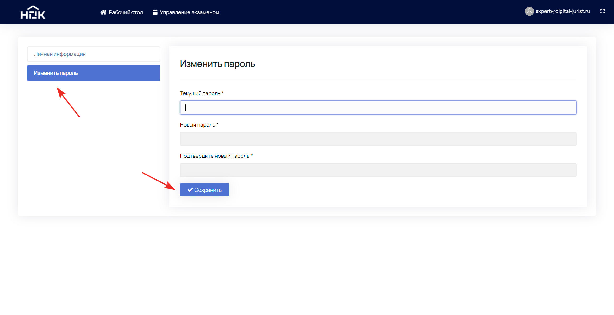

# Руководство эксперта

**Список обозначений и сокращений**
* **ПАК** - Программно-аппаратный комплекс
* **НОК** - Независимая оценка квалификации
* **ЭП** - экзаменационная площадка
* **ЭЦ** - экзаменационный центр

## Аннотация

Настоящий документ представляет собой руководство администратора ЦОК с ПАК НОК (далее **Руководство**).

Пользовательский интерфейс ПАК НОК обеспечивает проведение независимой оценки квалификации в форме профессионального экзамена.

Перед работой пользователя с ПАК НОК рекомендуется внимательно ознакомиться с настоящим руководством.

## Вход

Чтобы приступить к работе с ПАК НОК, необходимо выполнить вход. Для этого введите Ваши данные в поля **"Телефон / Email / СНИЛС"** и **"Пароль"**. Пароль должен был быть направлен на Вашу электронную почту. Если Вы не получили данные для входа, обратитесь в ЦОК.

Когда отобразится новое окно с надписью **"Продолжить как"**, нажмите на кнопку **"Эксперт"**.

## Настройки "Профиля"

Нажмите на иконку с человеком или адрес электронной почты в правом верхнем углу. Возникнет выпадающий список с возможными действиями.

Для работы с данными Вашего профиля, нажмите на пункт **"Профиль"**. Чтобы зайти под учетной записью соискателя, нажмите **"Перезайти"**. Нажмите **"Выйти"**, если Вы хотите завершить сеанс в ПАК НОК.

Откроются настройки с Личной информацией и Изменением пароля.

В разделе **"Личная информация"** можно редактировать данные. При изменении адреса электронной почты и/или телефонного номера, придётся их заново подтверждать. Обязательно сохраните последние изменения.

Задавайте новый пароль в любой момент с помощью раздела **"Изменить пароль"**. После подтверждения нового пароля обязательно нажмите **"Сохранить"**.

## Управление экзаменом

Из раздела **"Рабочий стол"** перейдем в раздел **"Управление экзаменом"**. Этот раздел предназначен для управления практическим экзаменом соискателей.

Можно воспользоваться поиском по созданным заявкам соискателей. Достаточно ввести информацию в строку со словом **"Поиск"** и нажать на лупу в конце строки. Для более точного поиска заявки присутствуют дополнительные фильтры.

В центре в таблице отображён список заявок с информацией по каждой заявке и их текущий статус.

Чтобы зайти в заявку, нажмите на шестерёнку с надписью **"Действия"** и **"Оценка экзамена"**.

В верхней части заявки содержится подробная информация об экзамене. Изначально строка **"Правильных ответов"** содержит цифру 0. После выставления оценки практических заданий, информация здесь обновится.

Ниже находится таблица **"Состав задания"** со столбцами, содержащими сведения по каждому вопросу практического задания.

Для проверки задания скачайте приложенные файлы, кликнув на иконки загрузки. Когда будете готовы, нажмите **"Оценить"** в столбце **"Действия"**.

Откроется новое окно, где можно выбрать результат задания и добавить собственные выводы. Нажмите **"Сохранить"**.

После оценки всех заданий практического экзамена нажмите **"Утвердить"**.

Необходимо подтвердить действие, нажав **"Да"**.

Страница обновится и в статусе заявки экзамена будет написано **"Пройден"**.

