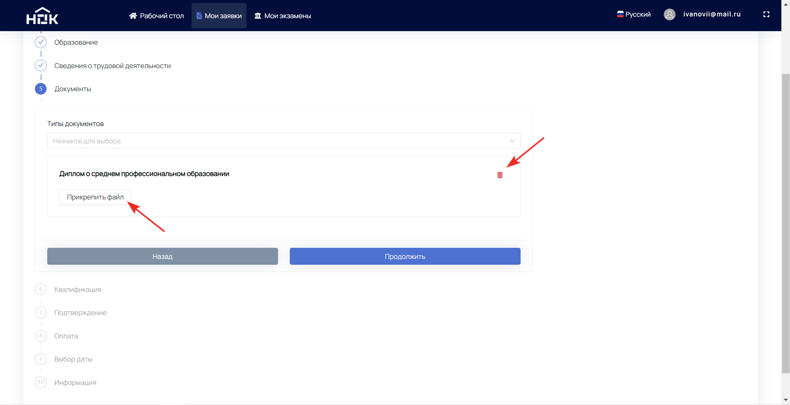
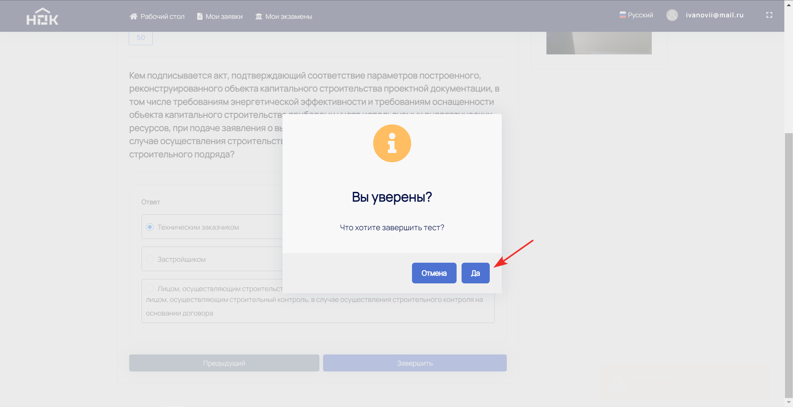

# Руководство соискателя

**Список обозначений и сокращений**
* **ПАК** - Программно-аппаратный комплекс
* **НОК** - Независимая оценка квалификации
* **ЭП** - экзаменационная площадка
* **ЭЦ** - экзаменационный центр

## Аннотация

Настоящий документ представляет собой руководство администратора ЦОК с ПАК НОК (далее **Руководство**).

Пользовательский интерфейс ПАК НОК обеспечивает проведение независимой оценки квалификации в форме профессионального экзамена.

Перед работой пользователя с ПАК НОК рекомендуется внимательно ознакомиться с настоящим руководством.

## Вход

Чтобы приступить к работе с ПАК НОК, необходимо выполнить поэтапную регистрацию нового пользователя. Для этого нажмите на подсвеченное слово "Регистрация" под кнопкой "Войти".

После этого откроется раздел 1.ИНФОРМАЦИЯ с полями для ввода данных.

Заполните поля (красной звёздочкой отмечены обязательные), поставьте галочку в поле согласия с обработкой персональных данных. Нажмите кнопку "Продолжить".

Раздел 2. ВЕРИФИКАЦИЯ предназначен для подтверждения учётной записи. Нажмите кнопку "Отправить код". После того, как письмо с кодом придёт на указанный почтовый ящик, введите его в пустое поле. Нажмите кнопку "Продолжить".

После обозначенных шагов высветится сообщение об успешной регистрации и автоматической переадресации.

В дальнейшем при входе потребуется ввести данные в поле "Телефон / Email / СНИЛС" и поле "Пароль". Затем нажать на кнопку "Войти".

## Начало работы

После переадресации высветится надпись "Продолжить как" и возможность зайти под соискателем для дальнейшей работы.

Перед Вами рабочий стол соискателя.

На самом верху расположены три основных раздела: "Рабочий стол" (где сейчас Вы находитесь), "Мои заявки" и "Мои экзамены".

Данные разделы будут подробнее рассмотрены ниже.

В правом верхнем углу слева направо находятся настройки: "Выбор языка", "Профиль" и "Полноэкранный режим".

## Настройки "Профиля"

Нажмите на адрес электронной почты в верхнем правом углу. Возникнет выпадающий список с возможными действиями.

Для работы с данными Вашего профиля, нажмите на пункт "Профиль".

Откроются настройки с Личной информацией и Изменением пароля.

В разделе "Личная информация" можно редактировать данные. При изменении адреса электронной почты и/или телефонного номера, придётся их заново подтверждать. Обязательно сохраните последние изменения.

Задавайте новый пароль в любой момент с помощью раздела "Изменить пароль".

## Мои заявки

Этот раздел предназначен для работы с заявками. По умолчанию этот раздел пуст. Рассмотрим вариант, когда заявка уже подана, но ещё не оплачена.

В правом верхнем углу расположена кнопка "Подать заявку" для подачи новой заявки.

Можно воспользоваться поиском по уже созданным заявкам. Достаточно ввести информацию в строку со словом "Поиск" и нажать на лупу в конце строки. Для более точного поиска заявки присутствуют дополнительные фильтры.

Ниже в таблице отображён список заявок с информацией по каждой и их текущий статус.
Чтобы зайти в заявку, нажмите на шестерёнку с надписью "Действия" и "Подробнее".

## Создание заявки

Для подачи новой заявки нажмите на кнопку "Начать".

Откроется черновик заявки, где нужно пошагово заполнить все поля.

Шаг 1. "Данные о соискателе". 

Заполнить все данные о себе. Красной звёздочкой обозначены обязательные для заполнения поля.

Нажмите "Продолжить".

Шаг 2. "Паспортные данные". 

Внесите все Ваши паспортные данные и нажмите "Продолжить". На любом этапе создания заявки можно вернуться назад и внести изменения.

Шаг 3. "Образование".

Чтобы загрузить информацию об образовании, нажмите кнопку "Добавить".
Выберите Вид образования из выпадающего списка. В зависимости от выбранного вида образования, дальнейшие поля будут меняться.

Рассмотрим стандартный случай, когда выбран вид "Образование". Возникает поле "Тип образования", где также необходимо выбрать из выпадающего списка Ваш вариант.

Когда все поля будут заполнены, нажмите "Продолжить".

Для удаления данных об образовании нажмите на Корзину в правом верхнем углу Шага 3. При необходимости можно добавлять информацию об образовании с помощью уже знакомой кнопки "Добавить".

Шаг 4. "Сведения о трудовой деятельности".

Если на данный момент Вы не работаете, то заполните все поля по предыдущему месту работы и нажмите "Продолжить".

Либо поставьте галочку в поле "Занят" и заполните информацию по текущему месту работы. Нажмите "Продолжить".

Шаг 5. "Документы".

На этом шаге можно дополнительно добавить необходимые документы (диплом о смене ФИО, документ подтверждающий стаж или иной другой документ). Аналогично предыдущему шагу выберите "Типы документов" из выпадающего списка.

Прикрепите документ с помощью кнопки "Прикрепить файл" или же нажмите на корзину, если ошибочно выбрали другой тип документа. ПАК НОК поддерживает загрузку файлов форматов JPEG, PNG, DOCX и PDF.

Шаг 6. "Квалификация".

Из выпадающего списка выберите квалификацию, по которой хотите пройти экзамен НОК.

Определите ближайшее к Вам место для непосредственной явки на экзамен. Нажмите продолжить.

Шаг 7. "Подтверждение".

Поставьте галочки в графах "Согласие на обработку персональных данных" и "Достоверность предоставленных данных подтверждаю".

Если Вы уверены, что все данные заполнены правильно, нажмите "Да", и заявка была передана в выбранный ЦОК.

После того как заявка будет рассмотрена, Вы получите уведомление на электронную почту.

Шаг 8. "Оплата".

Вернитесь к заявке в разделе "Мои заявки" и прикрепите документ об оплате, нажмите "Продолжить".

Дождитесь подтверждения оплаты от ЦОК.

Шаг 9. "Выбор даты".

Когда ЦОК проверит оплату и подтвердит её, автоматически откроется график экзаменов. В нём будут выделены свободные даты, время и количество мест, заведённых ЦОК.

Выберите подходящую дату и время на графике. Внизу высветится информация по предстоящему экзамену. Нажмите "Подтвердить".

Шаг 10. "Информация".

На этом шаге дублируется информация о предстоящем экзамене. Статус заявки наверху поменяется на "Экзамен назначен".

## Мои экзамены

До подачи заявки на проведение НОК этот раздел пуст. На скриншоте ниже уже назначен экзамен, но время начала ещё не наступило.

В этом разделе показаны все экзамены с возможностью поиска. Доступны дополнительные фильтры для точного поиска.

В назначенный день и время Вы должны находиться в указанном ЭЦ/ЭП. Кнопка "Пройти экзамен" появится в момент начала экзамена.

После нажатия на кнопку появится окно "Профессиональный экзамен", которое содержит данные по предстоящему экзамену.

Когда Вы будете готовы, нажмите на кнопку "Приступить".

Для достоверности результатов НОК необходимо пройти идентификацию посредством доступа к камере и разрешить запись рабочего стола.

Во всплывшем окне нажмите "Разрешить".

В правой части экрана под надписью "Камера" должно появиться изображение с вашей камеры.

Повторно нажмите кнопку "Приступить".

Примите положение согласно инструкции далее и нажмите "Выполнить идентификацию".

После успешной идентификации выберите "Весь экран" для демонстрации и нажмите "Поделиться".

С этого момента начнётся экзамен и запустится обратный отсчёт времени до конца попытки. Таймер находится в правом верхнем углу. В центре Вы можете видеть количество вопросов и осуществлять навигацию по каждому вопросу.

Ниже расположен текст вопроса и варианты ответа. Выберите один или несколько вариантов и нажмите "Следующий" или нажмите пропустить, если хотите вернуться к этому вопросу позже.

Фиолетовым цветом выделены уже отвеченные вопросы. Чтобы вернуться на вопрос назад и поменять ответ, можно также воспользоваться кнопкой "Предыдущий".

По окончании тестирования появится кнопка "Завершить". Нажмите на неё, когда будете готовы.

Подтвердите завершение тестирования посредством нажатия на кнопку "Да".

В случае неудачной попытки сдачи экзамена высветится сообщение "Экзамен не сдан" и вся необходимая информация.

Для повторной попытки необходимо заново выбрать дату и время экзамена. В разделе "Мои экзамены" в назначенный день и время в новой строке появится кнопка "Пройти экзамен".

В случае успешного прохождения экзамена высветится сообщение "Экзамен сдан".

Статус теоретического экзамена в разделе "Мои экзамены" в этом случае поменяется на "Пройден".

Чтобы приступить к сдаче практического экзамена, перейдите в "Мои заявки" и выберите время и дату. Вы можете сдать практику в этот же день после успешного прохождения теоретического экзамена.

В разделе "Мои экзамены" появится новая строка с типом экзамена "Практический", а в назначенный день и время откроется возможность "Пройти экзамен".

Необходимо пройти аналогичные шаги идентификации, как в теоретическом экзамене.
Вид окна сдачи практического экзамена схож с теоретическим экзаменом. Скачайте файл задания, выполните его и прикрепите файл с ответом.

Можете дополнительно оставить комментарий к выполненному заданию. Нажмите "Следующий".

После завершения практического экзамена появится сообщение: "Экзамен на проверке". Потребуется некоторое время (согласно регламенту) на то, чтобы коллегия экспертов ЦОК проверила задания и вынесла решение.

На этом этапе никаких действий с Вашей стороны не требуется. Дальнейшую информацию ожидайте от представителей ЦОК или ЭП.